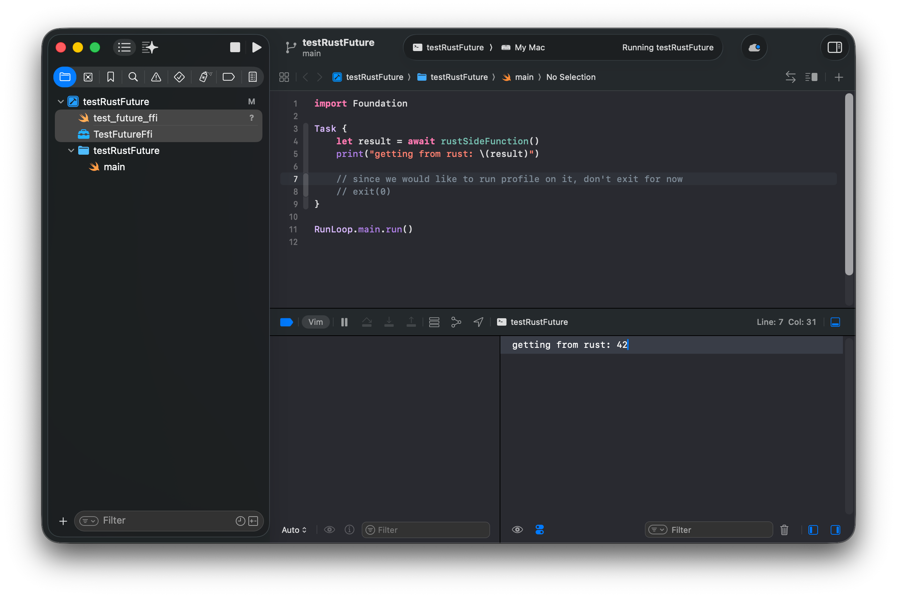
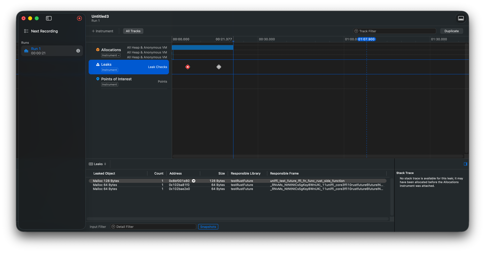

# mre-uniffi-future-leak-swift

This repository contains a minimal reproducible example (MRE) demonstrating a memory leak issue when using UniFFI-generated Swift bindings in a Rust project. The leak occurs when a Rust async function is exposed to Swift via UniFFI, and Swift code calls it.

## Setup
1. Clone the Repository to your local machine.
```shell
git clone https://github.com/b01o/mre-uniffi-future-leak-swift
```
2. Build the Rust library with UniFFI, generating the xcframework.
> [Just](https://github.com/casey/just) is used for build automation. Or you can run the commands manually. 
```shell
cd mre-uniffi-future-leak-swift/rust-side/test_future_ffi && just build
```
3. Double click the `testRustFuture.xcodeproj` to open the Xcode project located in the `swift-side` directory, drag and drop the generated `TestFutureFFI.xcframework` and `test_future_ffi.swift` files into the Xcode project.

4. Run the Swift code in Xcode, which calls the Rust async function, should run without issues.


5. Press `cmd+I` to profile the program using Xcode's Instruments. Select the "Leaks" profiling template. Hit the record button to start profiling. After 10 seconds, should see memory leaks reported in the Instruments window.


